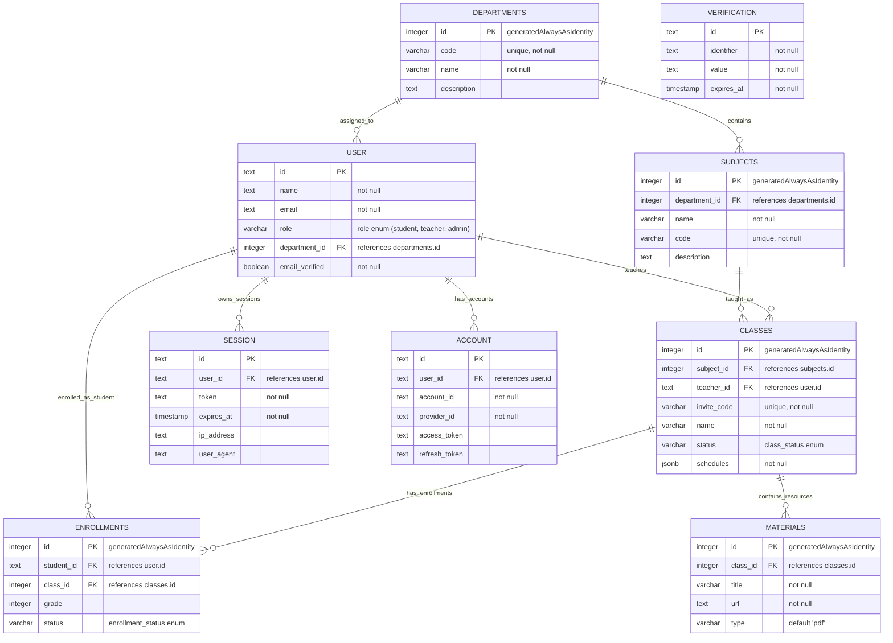

# Database Architecture Overview

## Relationships Summary

- **Departments & Subjects**: One-to-Many relationship where each department can house multiple subjects.
- **Departments & Users**: One-to-Many optional relationship. Users (especially Teachers/Admin) can be assigned to a specific department.
- **Subjects & Classes**: One-to-Many relationship. A subject can have multiple class instances.
- **Users & Classes**: One-to-Many relationship where a User with a `teacher` role is assigned to lead a class.
- **Classes & Enrollments**: One-to-Many relationship tracking which students are in which classes.
- **Users & Enrollments**: One-to-Many relationship connecting Students to their course enrollments.
- **Classes & Materials**: One-to-Many relationship for educational resources assigned to a class.
- **Auth Tables**: `USER` is linked to `SESSION` and `ACCOUNT` for authentication management, while `VERIFICATION` handles token-based processes.
